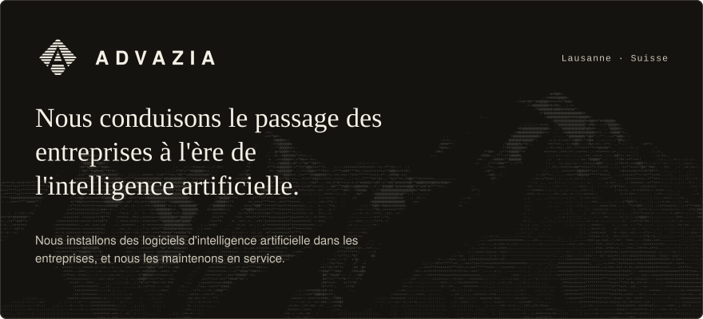
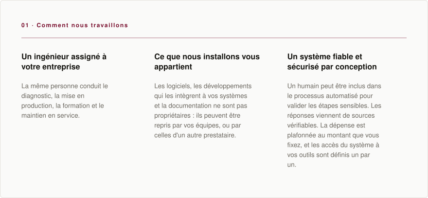
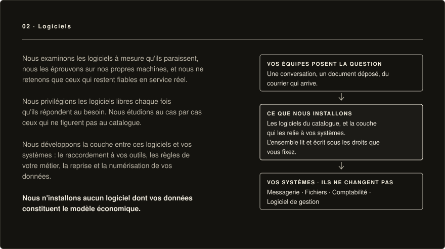
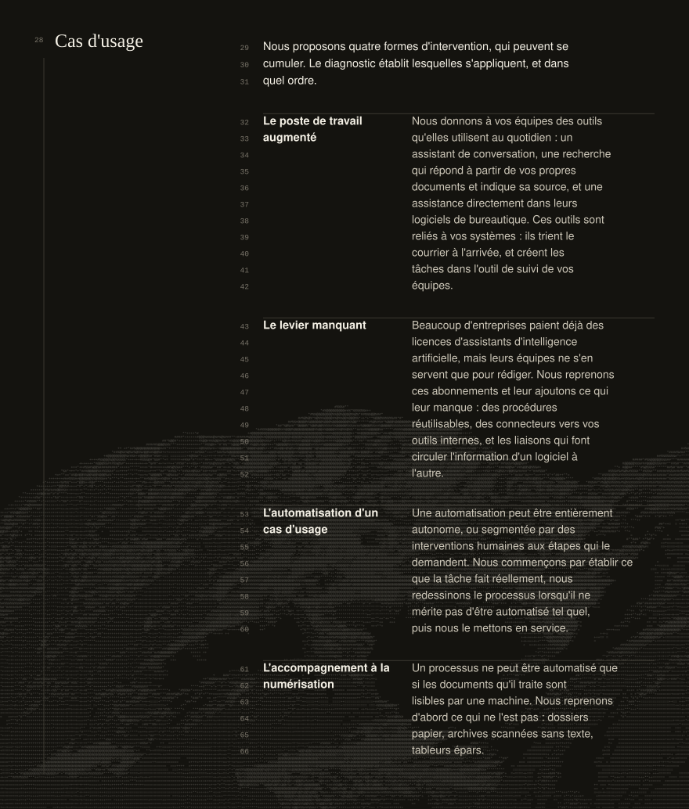
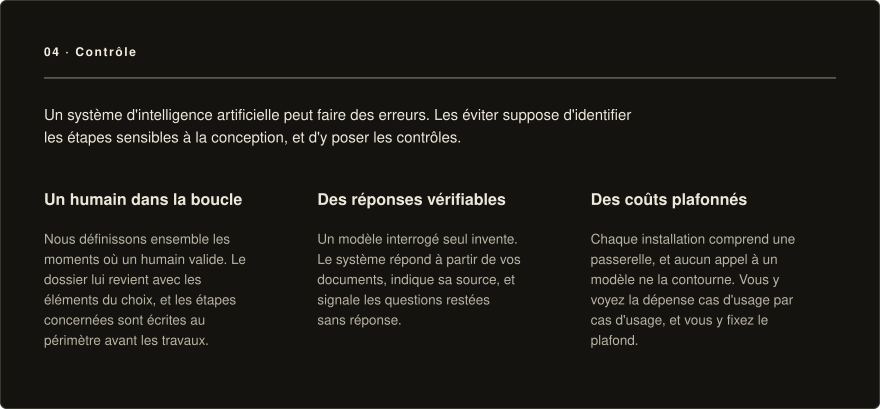
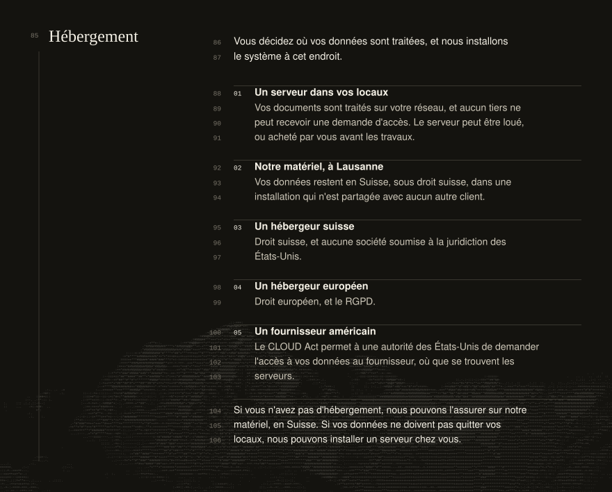
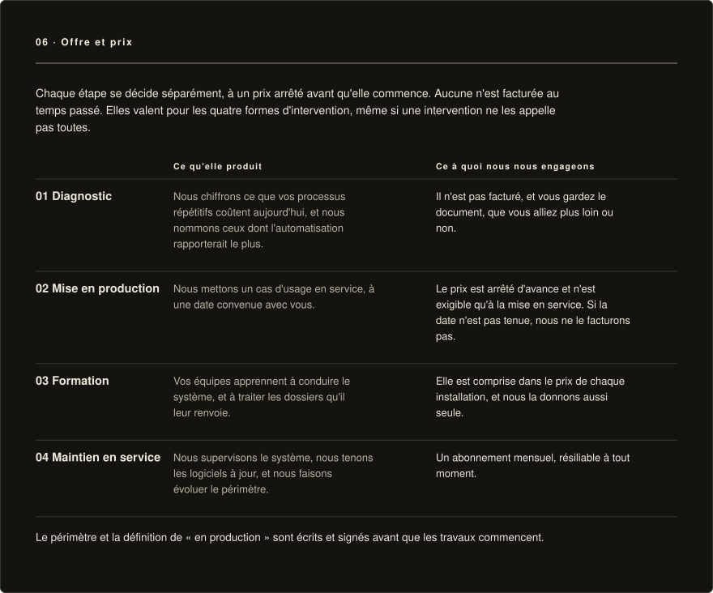
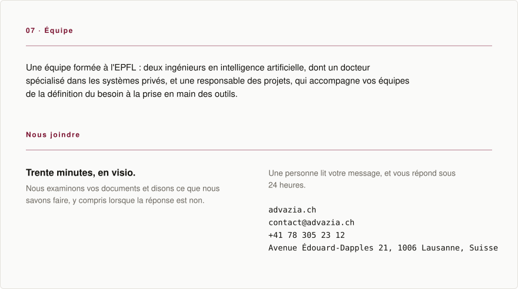

<p align="center">
  
</p>

<p align="center">
  <a href="https://advazia.ch/"></a>
  <a href="https://www.linkedin.com/company/advazia/"></a>
  <a href="https://advazia.ch/agence-ia-lausanne/"></a>
  <a href="https://advazia.ch/en/"></a>
</p>

<p align="center">
  
</p>

<p align="center">
  
</p>

<p align="center"><sub><i><a href="https://advazia.ch/catalogue/">Le catalogue complet</a></i></sub></p>

<p align="center">
  
</p>

<p align="center"><sub><i><a href="https://advazia.ch/cas-usage/">Les cas d'usage en détail</a></i></sub></p>

<p align="center">
  
</p>

<p align="center">
  
</p>

<p align="center"><sub><i><a href="https://advazia.ch/hebergement/">Les hébergements en détail</a></i></sub></p>

<p align="center">
  
</p>

<p align="center"><sub><i><a href="https://advazia.ch/methode/">La méthode en détail</a> · <a href="https://advazia.ch/formation/">La formation</a></i></sub></p>

<p align="center">
  
</p>

<p align="center"><sub><i><a href="https://advazia.ch/equipe/">L'équipe</a> · <a href="https://book.advazia.ch/advazia/appel-decouverte">Choisir une date</a></i></sub></p>

<details>
<summary>version texte (lecteurs d'écran, écrans étroits, affichage brut)</summary>

```
┌─ FIG_000 · ADVAZIA ───────────────────── accueil ─┐
│                                                    │
│  Nous conduisons le passage des entreprises à      │
│  l'ère de l'intelligence artificielle.             │
│                                                    │
│  Nous installons des logiciels d'intelligence      │
│  artificielle dans les entreprises, et nous les    │
│  maintenons en service.                            │
│                                                    │
└────────────────────────────────────────────────────┘

┌─ FIG_001 · COMMENT NOUS TRAVAILLONS ───────── 01 ─┐
│                                                    │
│  Un ingénieur assigné à votre entreprise           │
│    La même personne conduit le diagnostic, la      │
│    mise en production, la formation et le          │
│    maintien en service.                            │
│                                                    │
│  Ce que nous installons vous appartient            │
│    Les logiciels, les développements qui les       │
│    intègrent à vos systèmes et la documentation    │
│    ne sont pas propriétaires : ils peuvent être    │
│    repris par vos équipes, ou par celles d'un      │
│    autre prestataire.                              │
│                                                    │
│  Un système fiable et sécurisé par conception      │
│    Un humain peut être inclus dans le processus    │
│    automatisé pour valider les étapes sensibles.   │
│    Les réponses viennent de sources vérifiables.   │
│    La dépense est plafonnée au montant que vous    │
│    fixez, et les accès du système à vos outils     │
│    sont définis un par un.                         │
│                                                    │
└────────────────────────────────────────────────────┘

┌─ FIG_002 · LOGICIELS ──────────────────────── 02 ─┐
│                                                    │
│  Nous examinons les logiciels à mesure qu'ils      │
│  paraissent, nous les éprouvons sur nos propres    │
│  machines, et nous ne retenons que ceux qui        │
│  restent fiables en service réel.                  │
│                                                    │
│  Nous privilégions les logiciels libres chaque     │
│  fois qu'ils répondent au besoin. Nous étudions    │
│  au cas par cas ceux qui ne figurent pas au        │
│  catalogue.                                        │
│                                                    │
│  Nous développons la couche entre ces logiciels    │
│  et vos systèmes : le raccordement à vos           │
│  outils, les règles de votre métier, la reprise    │
│  et la numérisation de vos données.                │
│                                                    │
│  Nous n'installons aucun logiciel dont vos         │
│  données constituent le modèle économique.         │
│                                                    │
│  VOS ÉQUIPES POSENT LA QUESTION                    │
│    Une conversation, un document déposé, du courrier qui arrive.│
│        ↓                                           │
│  CE QUE NOUS INSTALLONS                            │
│    Les logiciels du catalogue, et la couche qui    │
│    les relie à vos systèmes. L'ensemble lit et     │
│    écrit sous les droits que vous fixez.           │
│        ↓                                           │
│  VOS SYSTÈMES · ILS NE CHANGENT PAS                │
│    Messagerie · Fichiers · Comptabilité · Logiciel de gestion│
│                                                    │
└────────────────────────────────────────────────────┘

┌─ FIG_003 · CAS D'USAGE ────────────────────── 03 ─┐
│                                                    │
│  Nous proposons quatre formes d'intervention,      │
│  qui peuvent se cumuler. Le diagnostic établit     │
│  lesquelles s'appliquent, et dans quel ordre.      │
│                                                    │
│  Le poste de travail augmenté                      │
│    Nous donnons à vos équipes des outils qu'elles  │
│    utilisent au quotidien : un assistant de        │
│    conversation, une recherche qui répond à        │
│    partir de vos propres documents et indique sa   │
│    source, et une assistance directement dans      │
│    leurs logiciels de bureautique. Ces outils      │
│    sont reliés à vos systèmes : ils trient le      │
│    courrier à l'arrivée, et créent les tâches      │
│    dans l'outil de suivi de vos équipes.           │
│                                                    │
│  Le levier manquant                                │
│    Beaucoup d'entreprises paient déjà des          │
│    licences d'assistants d'intelligence            │
│    artificielle, mais leurs équipes ne s'en        │
│    servent que pour rédiger. Nous reprenons ces    │
│    abonnements et leur ajoutons ce qui leur        │
│    manque : des procédures réutilisables, des      │
│    connecteurs vers vos outils internes, et les    │
│    liaisons qui font circuler l'information d'un   │
│    logiciel à l'autre.                             │
│                                                    │
│  L'automatisation d'un cas d'usage                 │
│    Une automatisation peut être entièrement        │
│    autonome, ou segmentée par des interventions    │
│    humaines aux étapes qui le demandent. Nous      │
│    commençons par établir ce que la tâche fait     │
│    réellement, nous redessinons le processus       │
│    lorsqu'il ne mérite pas d'être automatisé tel   │
│    quel, puis nous le mettons en service.          │
│                                                    │
│  L'accompagnement à la numérisation                │
│    Un processus ne peut être automatisé que si     │
│    les documents qu'il traite sont lisibles par    │
│    une machine. Nous reprenons d'abord ce qui ne   │
│    l'est pas : dossiers papier, archives scannées  │
│    sans texte, tableurs épars.                     │
│                                                    │
└────────────────────────────────────────────────────┘

┌─ FIG_004 · CONTRÔLE ───────────────────────── 04 ─┐
│                                                    │
│  Un système d'intelligence artificielle peut       │
│  faire des erreurs. Les éviter suppose             │
│  d'identifier les étapes sensibles à la            │
│  conception, et d'y poser les contrôles.           │
│                                                    │
│  Un humain dans la boucle                          │
│    Nous définissons ensemble les moments où un     │
│    humain valide. Le dossier lui revient avec les  │
│    éléments du choix, et les étapes concernées     │
│    sont écrites au périmètre avant les travaux.    │
│                                                    │
│  Des réponses vérifiables                          │
│    Un modèle interrogé seul invente. Le système    │
│    répond à partir de vos documents, indique sa    │
│    source, et signale les questions restées sans   │
│    réponse.                                        │
│                                                    │
│  Des coûts plafonnés                               │
│    Chaque installation comprend une passerelle,    │
│    et aucun appel à un modèle ne la contourne.     │
│    Vous y voyez la dépense cas d'usage par cas     │
│    d'usage, et vous y fixez le plafond.            │
│                                                    │
└────────────────────────────────────────────────────┘

┌─ FIG_005 · HÉBERGEMENT ────────────────────── 05 ─┐
│                                                    │
│  Vous décidez où vos données sont traitées, et     │
│  nous installons le système à cet endroit.         │
│                                                    │
│  01  Un serveur dans vos locaux                    │
│      Vos documents sont traités sur votre réseau,  │
│      et aucun tiers ne peut recevoir une demande   │
│      d'accès. Le serveur peut être loué, ou acheté │
│      par vous avant les travaux.                   │
│                                                    │
│  02  Notre matériel, à Lausanne                    │
│      Vos données restent en Suisse, sous droit     │
│      suisse, dans une installation qui n'est       │
│      partagée avec aucun autre client.             │
│                                                    │
│  03  Un hébergeur suisse                           │
│      Droit suisse, et aucune société soumise à la  │
│      juridiction des États-Unis.                   │
│                                                    │
│  04  Un hébergeur européen                         │
│      Droit européen, et le RGPD.                   │
│                                                    │
│  05  Un fournisseur américain                      │
│      Le CLOUD Act permet à une autorité des        │
│      États-Unis de demander l'accès à vos données  │
│      au fournisseur, où que se trouvent les        │
│      serveurs.                                     │
│                                                    │
│  Si vous n'avez pas d'hébergement, nous pouvons    │
│  l'assurer sur notre matériel, en Suisse. Si       │
│  vos données ne doivent pas quitter vos locaux,    │
│  nous pouvons installer un serveur chez vous.      │
│                                                    │
└────────────────────────────────────────────────────┘

┌─ FIG_006 · OFFRE ET PRIX ──────────────────── 06 ─┐
│                                                    │
│  Chaque étape se décide séparément, à un prix      │
│  arrêté avant qu'elle commence. Aucune n'est       │
│  facturée au temps passé. Elles valent pour les    │
│  quatre formes d'intervention, même si une         │
│  intervention ne les appelle pas toutes.           │
│                                                    │
│  01  Diagnostic                                    │
│      Nous chiffrons ce que vos processus répétitifs│
│      coûtent aujourd'hui, et nous nommons ceux dont│
│      l'automatisation rapporterait le plus.        │
│      Il n'est pas facturé, et vous gardez le       │
│      document, que vous alliez plus loin ou non.   │
│                                                    │
│  02  Mise en production                            │
│      Nous mettons un cas d'usage en service, à une │
│      date convenue avec vous.                      │
│      Le prix est arrêté d'avance et n'est exigible │
│      qu'à la mise en service. Si la date n'est pas │
│      tenue, nous ne le facturons pas.              │
│                                                    │
│  03  Formation                                     │
│      Vos équipes apprennent à conduire le système, │
│      et à traiter les dossiers qu'il leur renvoie. │
│      Elle est comprise dans le prix de chaque      │
│      installation, et nous la donnons aussi seule. │
│                                                    │
│  04  Maintien en service                           │
│      Nous supervisons le système, nous tenons les  │
│      logiciels à jour, et nous faisons évoluer le  │
│      périmètre.                                    │
│      Un abonnement mensuel, résiliable à tout      │
│      moment.                                       │
│                                                    │
│  Le périmètre et la définition de « en             │
│  production » sont écrits et signés avant que      │
│  les travaux commencent.                           │
│                                                    │
└────────────────────────────────────────────────────┘

┌─ FIG_007 · ÉQUIPE ─────────────────────────── 07 ─┐
│                                                    │
│  Une équipe formée à l'EPFL : deux ingénieurs      │
│  en intelligence artificielle, dont un docteur     │
│  spécialisé dans les systèmes privés, et une       │
│  responsable des projets, qui accompagne vos       │
│  équipes de la définition du besoin à la prise     │
│  en main des outils.                               │
│                                                    │
│  NOUS JOINDRE                                      │
│    Trente minutes, en visio.                       │
│    Nous examinons vos documents et disons ce que   │
│    nous savons faire, y compris lorsque la         │
│    réponse est non.                                │
│                                                    │
│    Une personne lit votre message, et vous répond  │
│    sous 24 heures.                                 │
│                                                    │
│    advazia.ch                                      │
│    contact@advazia.ch                              │
│    +41 78 305 23 12                                │
│    Avenue Édouard-Dapples 21, 1006 Lausanne, Suisse│
│    linkedin.com/company/advazia                    │
│                                                    │
└────────────────────────────────────────────────────┘
```

</details>
