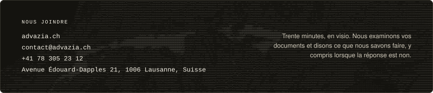

<p align="center">
  
</p>

<p align="center">
  <a href="https://advazia.ch/"></a>
  <a href="https://www.linkedin.com/company/advazia/"></a>
  <a href="https://book.advazia.ch/advazia/appel-decouverte"></a>
  <a href="https://advazia.ch/en/"></a>
</p>

```text
┌─ 01 · COMMENT NOUS TRAVAILLONS ──────────────────────────────────────────────────────────────────┐
│                                                                                                  │
│  UN INGÉNIEUR ASSIGNÉ À VOTRE ENTREPRISE                                                         │
│      La même personne conduit le diagnostic, la mise en production, la formation et le maintien  │
│      en service.                                                                                 │
│                                                                                                  │
│  CE QUE NOUS INSTALLONS VOUS APPARTIENT                                                          │
│      Les logiciels, les développements qui les intègrent à vos systèmes et la documentation ne   │
│      sont pas propriétaires : ils peuvent être repris par vos équipes, ou par celles d'un autre  │
│      prestataire.                                                                                │
│                                                                                                  │
│  UN SYSTÈME FIABLE ET SÉCURISÉ PAR CONCEPTION                                                    │
│      Un humain peut être inclus dans le processus automatisé pour valider les étapes sensibles.  │
│      Les réponses viennent de sources vérifiables. La dépense est plafonnée au montant que vous  │
│      fixez, et les accès du système à vos outils sont définis un par un.                         │
│                                                                                                  │
└──────────────────────────────────────────────────────────────────────────────────────────────────┘
```

<p align="center"><sub><i><a href="https://advazia.ch/methode/">La méthode en détail</a></i></sub></p>

```text
┌─ 02 · LOGICIELS ─────────────────────────────────────────────────────────────────────────────────┐
│                                                                                                  │
│  Nous privilégions les logiciels libres chaque fois qu'ils répondent au besoin. Nous étudions au │
│  cas par cas ceux qui ne figurent pas au catalogue.                                              │
│                                                                                                  │
│  Nous développons la couche entre ces logiciels et vos systèmes : le raccordement à vos outils,  │
│  les règles de votre métier, la reprise et la numérisation de vos données.                       │
│                                                                                                  │
│  VOS ÉQUIPES POSENT LA QUESTION                                                                  │
│    Une conversation, un document déposé, du courrier qui arrive.                                 │
│                                                                                                  │
│                        │                                                                         │
│                        ▼                                                                         │
│                                                                                                  │
│  CE QUE NOUS INSTALLONS                                                                          │
│    Les logiciels du catalogue, et la couche qui les relie à vos systèmes. L'ensemble lit et      │
│    écrit sous les droits que vous fixez.                                                         │
│                                                                                                  │
│                        │                                                                         │
│                        ▼                                                                         │
│                                                                                                  │
│  VOS SYSTÈMES · ILS NE CHANGENT PAS                                                              │
│    ┌────────────┐ ┌──────────┐ ┌──────────────┐ ┌─────────────────────┐                          │
│    │ Messagerie │ │ Fichiers │ │ Comptabilité │ │ Logiciel de gestion │                          │
│    └────────────┘ └──────────┘ └──────────────┘ └─────────────────────┘                          │
│                                                                                                  │
│  ⚠ Nous n'installons aucun logiciel dont vos données constituent le modèle économique.           │
│                                                                                                  │
└──────────────────────────────────────────────────────────────────────────────────────────────────┘
```

<p align="center"><sub><i><a href="https://advazia.ch/catalogue/">Le catalogue complet</a></i></sub></p>

```text
┌─ 03 · CAS D'USAGE ───────────────────────────────────────────────────────────────────────────────┐
│                                                                                                  │
│  Nous proposons quatre formes d'intervention, qui peuvent se cumuler. Le diagnostic établit      │
│  lesquelles s'appliquent, et dans quel ordre.                                                    │
│                                                                                                  │
│  ┌──────────────────────────────────────────────────────────────────────────────────────────┐    │
│  │ Le poste de travail augmenté                                                             │    │
│  ├──────────────────────────────────────────────────────────────────────────────────────────┤    │
│  │ Le levier manquant                                                                       │    │
│  ├──────────────────────────────────────────────────────────────────────────────────────────┤    │
│  │ L'automatisation d'un cas d'usage                                                        │    │
│  ├──────────────────────────────────────────────────────────────────────────────────────────┤    │
│  │ L'accompagnement à la numérisation                                                       │    │
│  └──────────────────────────────────────────────────────────────────────────────────────────┘    │
│                                                                                                  │
└──────────────────────────────────────────────────────────────────────────────────────────────────┘
```

<p align="center"><sub><i><a href="https://advazia.ch/cas-usage/">Les cas d'usage en détail</a></i></sub></p>

```text
┌─ 04 · CONTRÔLE ──────────────────────────────────────────────────────────────────────────────────┐
│                                                                                                  │
│  Un système d'intelligence artificielle peut faire des erreurs. Les éviter suppose d'identifier  │
│  les étapes sensibles à la conception, et d'y poser les contrôles.                               │
│                                                                                                  │
│  ┌────────────────────────────┬───────────────────────────────────────────────────────────────┐  │
│  │ Un humain dans la boucle   │ Nous définissons ensemble les moments où un humain valide. Le │  │
│  │                            │ dossier lui revient avec les éléments du choix, et les étapes │  │
│  │                            │ concernées sont écrites au périmètre avant les travaux.       │  │
│  ├────────────────────────────┼───────────────────────────────────────────────────────────────┤  │
│  │ Des réponses vérifiables   │ Un modèle interrogé seul invente. Le système répond à partir  │  │
│  │                            │ de vos documents, indique sa source, et signale les questions │  │
│  │                            │ restées sans réponse.                                         │  │
│  ├────────────────────────────┼───────────────────────────────────────────────────────────────┤  │
│  │ Des coûts plafonnés        │ Chaque installation comprend une passerelle, et aucun appel à │  │
│  │                            │ un modèle ne la contourne. Vous y voyez la dépense cas        │  │
│  │                            │ d'usage par cas d'usage, et vous y fixez le plafond.          │  │
│  └────────────────────────────┴───────────────────────────────────────────────────────────────┘  │
│                                                                                                  │
└──────────────────────────────────────────────────────────────────────────────────────────────────┘
```

```text
┌─ 05 · HÉBERGEMENT ───────────────────────────────────────────────────────────────────────────────┐
│                                                                                                  │
│  Vous décidez où vos données sont traitées, et nous installons le système à cet endroit.         │
│                                                                                                  │
│  ┌────┬──────────────────────────────┬────────────────────────────────────────────────────────┐  │
│  │ 01 │ Un serveur dans vos locaux   │ Vos documents sont traités sur votre réseau, et aucun  │  │
│  │    │                              │ tiers ne peut recevoir une demande d'accès. Le serveur │  │
│  │    │                              │ peut être loué, ou acheté par vous avant les travaux.  │  │
│  ├────┼──────────────────────────────┼────────────────────────────────────────────────────────┤  │
│  │ 02 │ Notre matériel, à Lausanne   │ Vos données restent en Suisse, sous droit suisse, dans │  │
│  │    │                              │ une installation qui n'est partagée avec aucun autre   │  │
│  │    │                              │ client.                                                │  │
│  ├────┼──────────────────────────────┼────────────────────────────────────────────────────────┤  │
│  │ 03 │ Un hébergeur suisse          │ Droit suisse, et aucune société soumise à la           │  │
│  │    │                              │ juridiction des États-Unis.                            │  │
│  ├────┼──────────────────────────────┼────────────────────────────────────────────────────────┤  │
│  │ 04 │ Un hébergeur européen        │ Droit européen, et le RGPD.                            │  │
│  ├────┼──────────────────────────────┼────────────────────────────────────────────────────────┤  │
│  │ 05 │ Un fournisseur américain     │ Le CLOUD Act permet à une autorité des États-Unis de   │  │
│  │    │                              │ demander l'accès à vos données au fournisseur, où que  │  │
│  │    │                              │ se trouvent les serveurs.                              │  │
│  └────┴──────────────────────────────┴────────────────────────────────────────────────────────┘  │
│                                                                                                  │
│  Si vous n'avez pas d'hébergement, nous pouvons l'assurer sur notre matériel, en Suisse. Si vos  │
│  données ne doivent pas quitter vos locaux, nous pouvons installer un serveur chez vous.         │
│                                                                                                  │
└──────────────────────────────────────────────────────────────────────────────────────────────────┘
```

<p align="center"><sub><i><a href="https://advazia.ch/hebergement/">Les hébergements en détail</a></i></sub></p>

```text
┌─ 06 · OFFRE ET PRIX ─────────────────────────────────────────────────────────────────────────────┐
│                                                                                                  │
│  Chaque étape se décide séparément, à un prix arrêté avant qu'elle commence. Aucune n'est        │
│  facturée au temps passé. Elles valent pour les quatre formes d'intervention, même si une        │
│  intervention ne les appelle pas toutes.                                                         │
│                                                                                                  │
│  ┌──────────────────────┬────────────────────────────────────┬────────────────────────────────┐  │
│  │                      │ CE QU'ELLE PRODUIT                 │ CE À QUOI NOUS NOUS ENGAGEONS  │  │
│  ├──────────────────────┼────────────────────────────────────┼────────────────────────────────┤  │
│  │ Diagnostic           │ Nous chiffrons ce que vos          │ Il n'est pas facturé, et vous  │  │
│  │                      │ processus répétitifs coûtent       │ gardez le document, que vous   │  │
│  │                      │ aujourd'hui, et nous nommons ceux  │ alliez plus loin ou non.       │  │
│  │                      │ dont l'automatisation rapporterait │                                │  │
│  │                      │ le plus.                           │                                │  │
│  ├──────────────────────┼────────────────────────────────────┼────────────────────────────────┤  │
│  │ Mise en production   │ Nous mettons un cas d'usage en     │ Le prix est arrêté d'avance et │  │
│  │                      │ service, à une date convenue avec  │ n'est exigible qu'à la mise en │  │
│  │                      │ vous.                              │ service. Si la date n'est pas  │  │
│  │                      │                                    │ tenue, nous ne le facturons    │  │
│  │                      │                                    │ pas.                           │  │
│  ├──────────────────────┼────────────────────────────────────┼────────────────────────────────┤  │
│  │ Formation            │ Vos équipes apprennent à conduire  │ Elle est comprise dans le prix │  │
│  │                      │ le système, et à traiter les       │ de chaque installation, et     │  │
│  │                      │ dossiers qu'il leur renvoie.       │ nous la donnons aussi seule.   │  │
│  ├──────────────────────┼────────────────────────────────────┼────────────────────────────────┤  │
│  │ Maintien en service  │ Nous supervisons le système, nous  │ Un abonnement mensuel,         │  │
│  │                      │ tenons les logiciels à jour, et    │ résiliable à tout moment.      │  │
│  │                      │ nous faisons évoluer le périmètre. │                                │  │
│  └──────────────────────┴────────────────────────────────────┴────────────────────────────────┘  │
│                                                                                                  │
│  Le périmètre et la définition de « en production » sont écrits et signés avant que les travaux  │
│  commencent.                                                                                     │
│                                                                                                  │
└──────────────────────────────────────────────────────────────────────────────────────────────────┘
```

<p align="center"><sub><i><a href="https://advazia.ch/methode/">La méthode en détail</a> · <a href="https://advazia.ch/formation/">La formation</a></i></sub></p>

```text
┌─ 07 · ÉQUIPE ────────────────────────────────────────────────────────────────────────────────────┐
│                                                                                                  │
│  Une équipe formée à l'EPFL : deux ingénieurs en intelligence artificielle, dont un docteur      │
│  spécialisé dans les systèmes privés, et une responsable des projets, qui accompagne vos équipes │
│  de la définition du besoin à la prise en main des outils.                                       │
│                                                                                                  │
│  NOUS JOINDRE                                                                                    │
│      Trente minutes, en visio. Nous examinons vos documents et disons ce que nous savons faire, y│
│      compris lorsque la réponse est non.                                                         │
│      Une personne lit votre message, et vous répond sous 24 heures.                              │
│                                                                                                  │
│      advazia.ch · contact@advazia.ch · +41 78 305 23 12                                          │
│      Avenue Édouard-Dapples 21, 1006 Lausanne, Suisse                                            │
│                                                                                                  │
└──────────────────────────────────────────────────────────────────────────────────────────────────┘
```

<p align="center"><sub><i><a href="https://advazia.ch/equipe/">L'équipe</a> · <a href="https://book.advazia.ch/advazia/appel-decouverte">Choisir une date</a></i></sub></p>

<p align="center">
  
</p>
